# Navodila za uporabo — BIO Alinity

Aplikacija **BIO Alinity** na tablici je namenjena spremljanju notranje kontrole kakovosti (QC) ter pregledu zaloge, naročanju in vodenju vzdrževanja in servisov za analizatorje **Abbott Alinity** (linije c in i) v Laboratoriju BK. Zaloga se prebere iz aplikacije Pregled BK (Zebra), QC, vzdrževanje in servisi pa se vodijo neposredno v tej aplikaciji.

Ta navodila se samodejno posodabljajo ob vsaki nadgradnji aplikacije (gradnja prek GitHub Actions). Posnetki zaslonov so zajeti neposredno iz trenutne različice aplikacije.

## Glavni zaslon in navigacija

Na vrhu vsakega zaslona je glava z imenom aplikacije **BIO ALINITY** in tremi števci zaloge:

- **Kos** — skupno število kosov v zalogi.
- **Exp** (rdeče) — število artiklov s potečenim rokom.
- **14d** (oranžno) — število artiklov, ki potečejo v 14 dneh.

Desno zgoraj je gumb **☁ Sync** za sinhronizacijo podatkov prek OneDrive.

Na dnu zaslona je glavna navigacija s sedmimi zavihki:

- **Zaloga** — pregled trenutne zaloge (samo za branje, vir: Pregled BK).
- **Roki** — artikli, razvrščeni po roku uporabe.
- **Loti** — pregled po lotih (serijah).
- **Naročila** — priprava naročila, minimalna zaloga, statistika.
- **Servis** — vpis in pregled servisnih posegov ter napak.
- **QC** — notranja kontrola kakovosti (vnos, pregled, Levey-Jennings, vzdrževanje).
- **Več** — sinhronizacija, nastavitve, operaterji, mesečna poročila.

## Zaloga

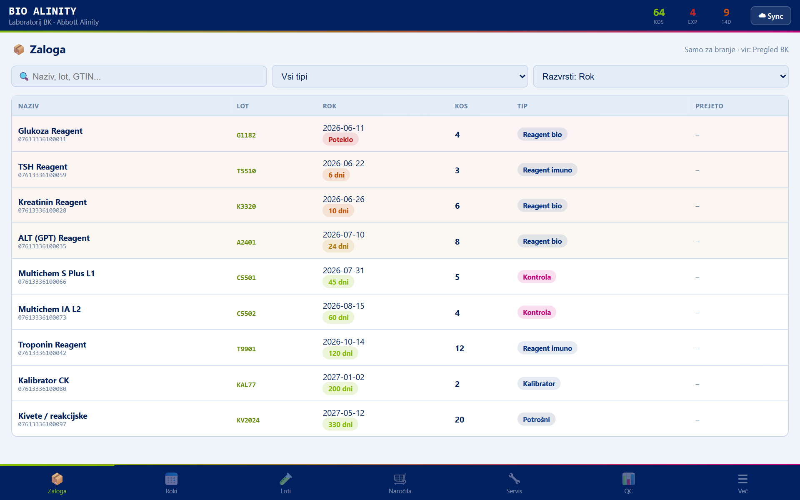

Zavihek **Zaloga** prikazuje trenutno stanje materiala. Podatki so **samo za branje** in se prenesejo iz aplikacije Pregled BK (prek OneDrive sinhronizacije ali uvoza).

- Z iskalnikom iščete po nazivu, lotu ali GTIN.
- Filter **tipa** loči reagente (biokemija/imunologija), kalibratorje, kontrole in potrošni material.
- Z **Razvrsti** uredite seznam po roku, nazivu ali količini.
- Vsaka vrstica prikazuje naziv, lot, rok uporabe (barvno označen), količino in tip.

## Barvne oznake rokov uporabe

Rok uporabe je obarvan po istem ključu kot v aplikaciji Pregled BK:

- **Rdeče — Poteklo**: rok je že potekel.
- **Oranžno (≤ 14 dni)**: artikel poteče v 14 dneh ali manj.
- **Rumeno (≤ 28 dni)**: artikel poteče v 28 dneh ali manj.
- **Zeleno (> 28 dni)**: rok je daljši od 28 dni.

## Roki

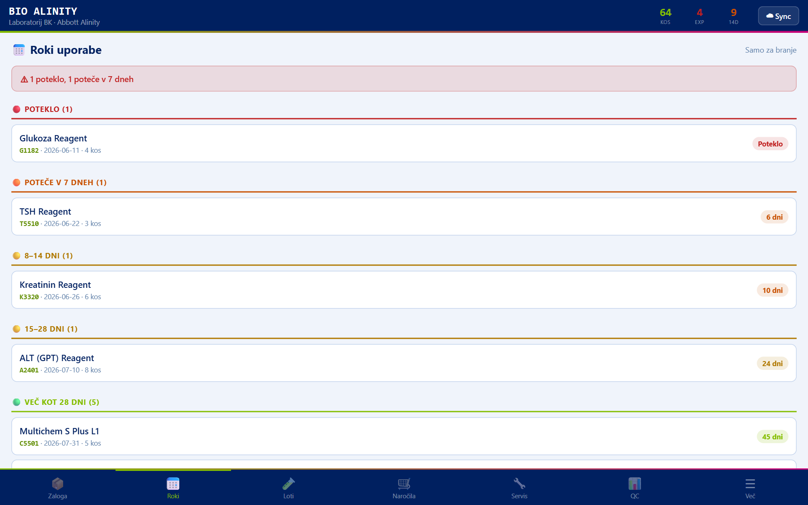

Zavihek **Roki** razvrsti artikle po roku uporabe v skupine: **Poteklo**, **Poteče v 7 dneh**, **8–14 dni**, **15–28 dni** in **Več kot 28 dni**. Na vrhu se ob nujnih primerih (poteklo ali ≤ 7 dni) prikaže opozorilni trak. Tako hitro vidite, kaj je treba porabiti ali zavreči.

## Loti

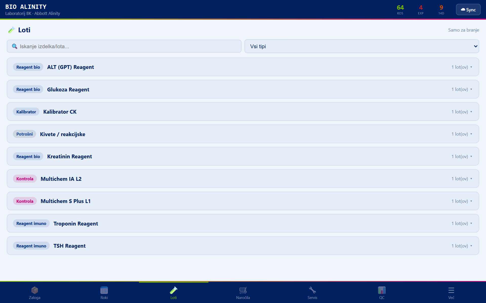

Zavihek **Loti** združi zalogo po izdelkih in lotih (serijah). Za vsak izdelek vidite posamezne lote, rok uporabe in količino. Uporabno za sledenje, kdaj poteče posamezna serija.

## Naročila

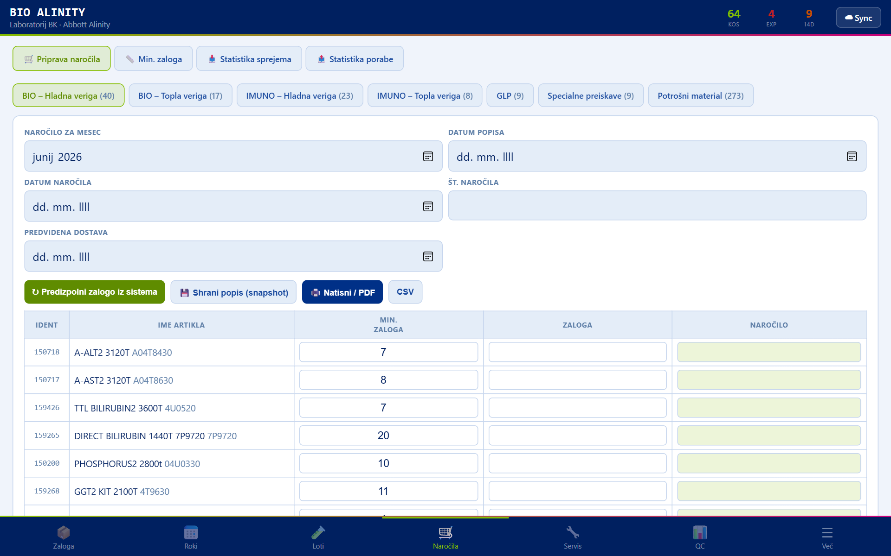

Zavihek **Naročila** ima štiri podzavihke:

- **Priprava naročila** — sistem primerja trenutno zalogo z minimalno zalogo in predlaga količine za naročilo; naročilo lahko izvozite v PDF.
- **Min. zaloga** — urejanje praga minimalne zaloge za posamezne artikle.
- **Statistika sprejema** — pregled prejetega materiala skozi čas.
- **Statistika porabe** — pregled porabe materiala.

## Servis

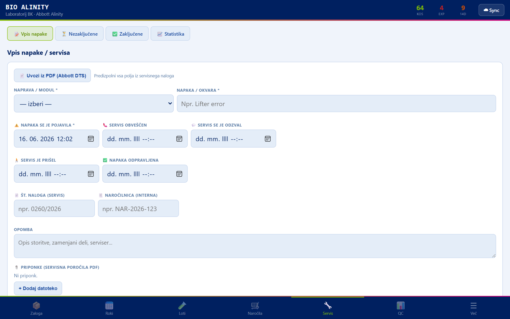

Zavihek **Servis** je namenjen vodenju servisnih posegov in napak na analizatorjih. Podzavihki:

- **Vpis napake** — vnesete analizator, opis napake/posega in po potrebi priponke.
- **Nezaključene** — odprti (še nezaključeni) servisni primeri.
- **Zaključene** — arhiv zaključenih posegov. Zaključitev se podpiše z matično številko (PIN).
- **Statistika** — pregled servisov po analizatorjih in vrstah napak.

## QC — notranja kontrola kakovosti

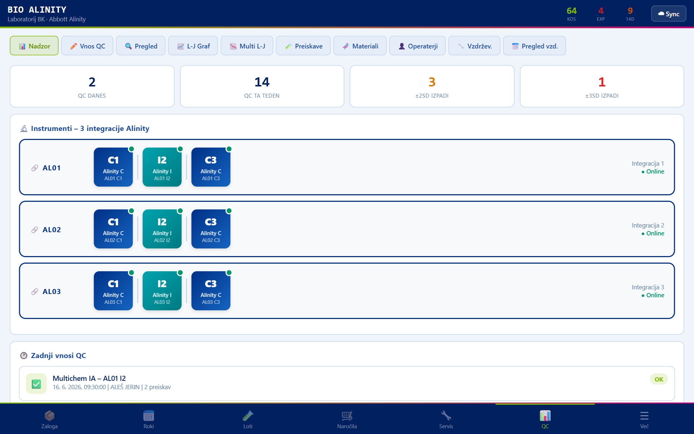

Zavihek **QC** je osrednji del aplikacije. Na vrhu so podzavihki:

- **Nadzor** — pregledni zaslon z zemljevidom analizatorjev (AL01–AL03, moduli C1/C3/I2) in stanjem kontrol.
- **Vnos QC** — vodeni vnos rezultatov kontrole kakovosti.
- **Pregled** — pregled vnesenih QC rezultatov.
- **L-J Graf** — Levey-Jennings graf za posamezno preiskavo in nivo kontrole.
- **Multi L-J** — Levey-Jennings za več nivojev hkrati.
- **Preiskave** — šifrant preiskav (biokemija / imunologija).
- **Materiali** — šifrant kontrolnih materialov (loti, nivoji).
- **Operaterji** — seznam operaterjev.
- **Vzdržev.** — vnos opravljenega vzdrževanja.
- **Pregled vzd.** — pregled opravljenega vzdrževanja in mesečna poročila.

### Vnos QC

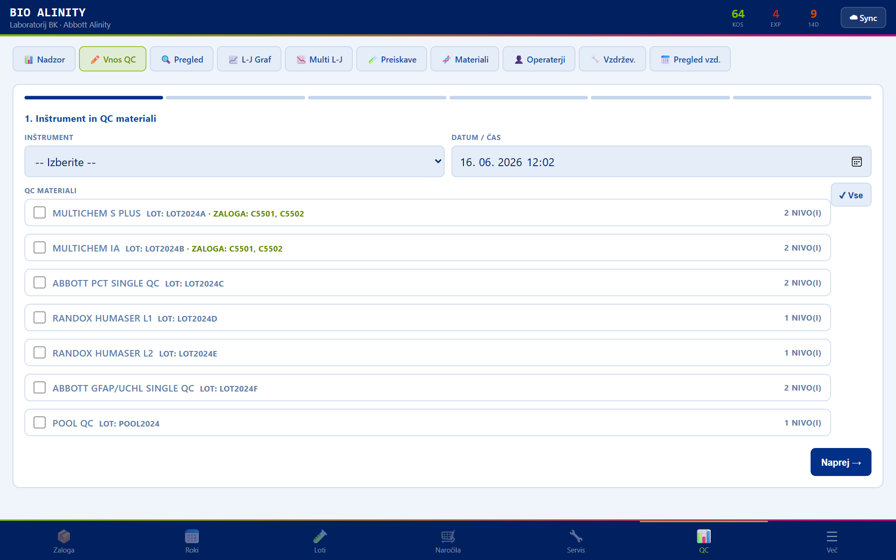

Vodeni vnos rezultatov poteka v korakih: izberete analizator in nivoje kontrole, nato preiskave, vnesete rezultate (odstopanja od SD), po potrebi dodate opombo in vnos podpišete z matično številko (PIN). Sistem samodejno preveri Westgardova pravila (1₂ₛ, 1₃ₛ, 2₂ₛ, R₄ₛ, 4₁ₛ, 10ₓ) in opozori na kršitve.

### Levey-Jennings graf

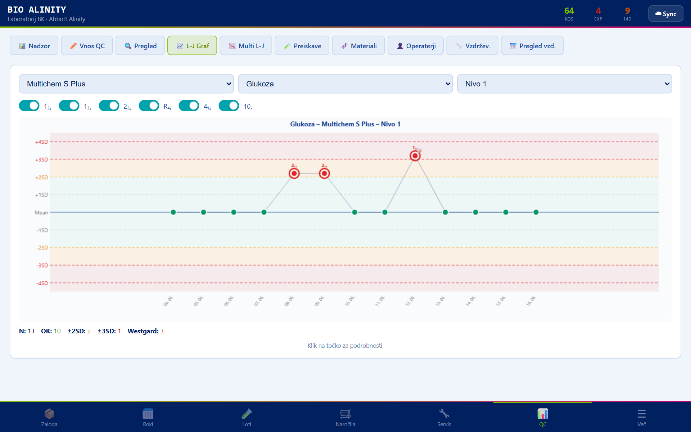

Graf **L-J** prikaže rezultate kontrole skozi čas glede na ciljno vrednost in SD-pasove (±1SD, ±2SD, ±3SD). Navpične črte označujejo dogodke (menjava lota, kalibracija). Tako vizualno spremljate trend in odstopanja.

### Vzdrževanje

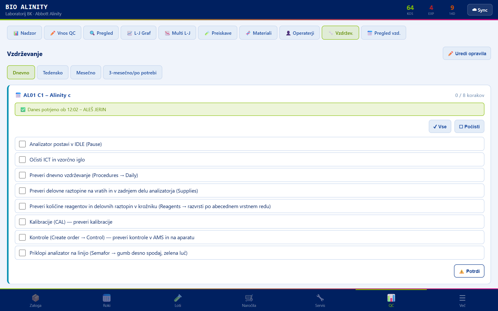

V podzavihku **Vzdržev.** beležite opravljena vzdrževalna opravila po analizatorjih. Opravila so razvrščena v razdelke **dnevno**, **tedensko**, **mesečno** in **3-mesečno** ter izhajajo iz uradnih obrazcev (OB KIKKB 213/64). Vsak opravljen korak se podpiše z matično številko (PIN), iz katere se izpiše parafa operaterja.

## Več

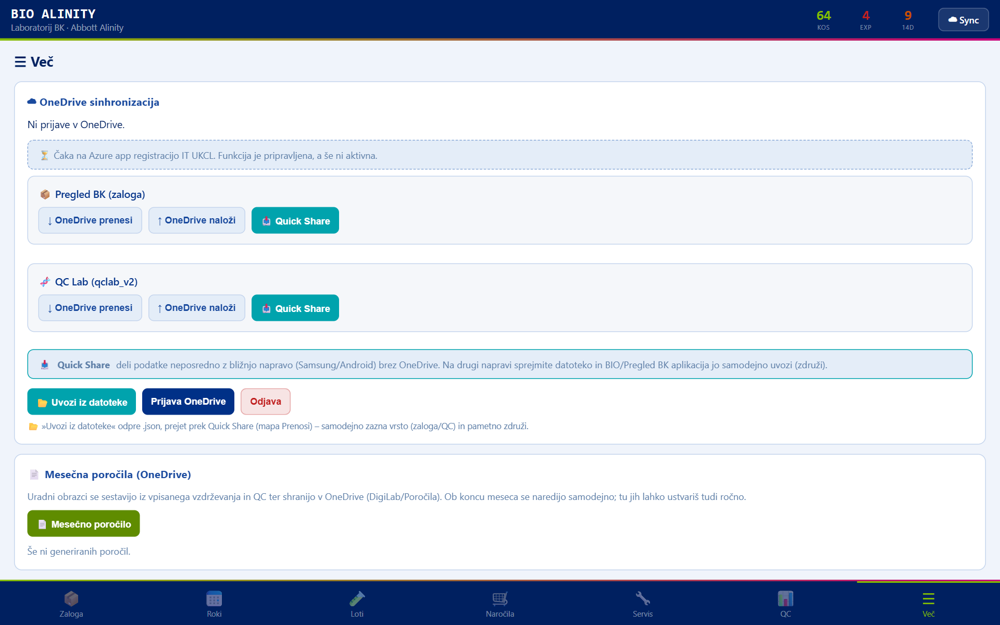

Zavihek **Več** vsebuje:

- **Sinhronizacija (OneDrive)** — prijava v OneDrive in izmenjava podatkov z aplikacijo Pregled BK (zaloga, operaterji). Operaterji se urejajo v BIO Alinity in se samodejno prenesejo na Zebro.
- **Izvoz / uvoz** — ročni izvoz in uvoz baz `qclab_v2` (QC) in `pregledBK_db` (zaloga) v datoteko JSON.
- **Nastavitve** — temni način. (Skeniranje in RFID sta na tablici onemogočena, ker tablica nima čitalca.)
- **Operaterji** — bližnjica do upravljanja operaterjev. 5-mestna matična številka je hkrati PIN za podpis QC in vzdrževanja.
- **O aplikaciji** — različica, build, naprava in poraba pomnilnika.

## Mesečna poročila

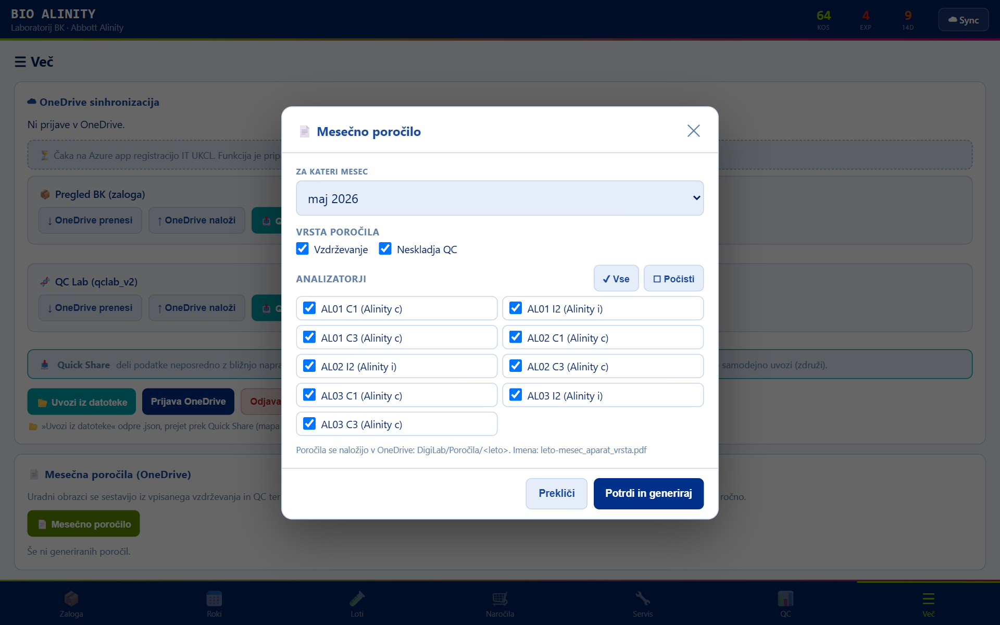

Aplikacija samodejno vsak mesec sestavi uradna PDF poročila za pretekli mesec po vzoru obrazcev:

- **Evidenca periodičnega vzdrževanja opreme** (OB KIKKB 213/64),
- **Vodenje neskladij pri notranji kontroli kakovosti** (OB KIKKB 216/64).

Poročila se shranijo v OneDrive v podmapo `DigiLab/Porocila/<leto>/` z doslednim poimenovanjem, npr. `2025-07_AL01-C1_vzdrzevanje.pdf` in `2025-07_AL01-I2_kontrole.pdf`.

Poročilo lahko ustvarite tudi ročno: v zavihku **Več** (ali v QC → Pregled vzd.) tapnite **📄 Mesečno poročilo**, izberite mesec, označite analizatorje in tip poročila (vzdrževanje / neskladja QC) ter potrdite z **Potrdi in generiraj**. Pod gumbom je seznam ustvarjenih poročil s statusom (naloženo / čaka na sinhronizacijo) in možnostjo odpiranja.

## Pogosta vprašanja

**Zakaj je zaloga prazna?**
Zaloga se prenese iz aplikacije Pregled BK. Preverite sinhronizacijo z OneDrive (Več → Sync) ali uvozite `pregledBK_db`.

**Kako podpišem QC vnos ali vzdrževanje?**
Z vašo 5-mestno matično številko (PIN). Operaterji se dodajajo v QC → Operaterji (ali Več → Operaterji).

**Kje najdem mesečna poročila?**
V OneDrive v mapi `DigiLab/Porocila/<leto>/`. Lokalna kopija je dostopna prek seznama poročil v aplikaciji.

**Westgardova kontrola me opozori na kršitev — kaj zdaj?**
Pri vnosu QC vpišete ukrep (npr. ponovitev kontrole, kalibracija, menjava reagenta, servis). Ukrep se zabeleži in se prikaže v mesečnem poročilu o neskladjih.
